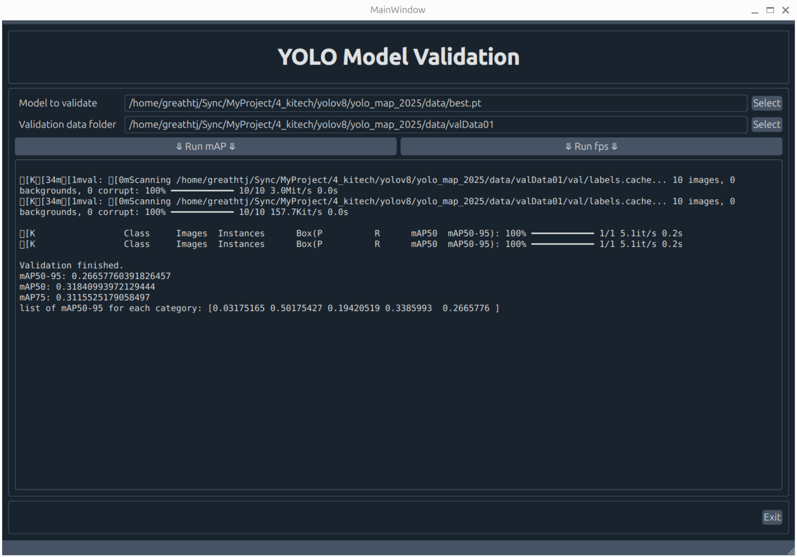
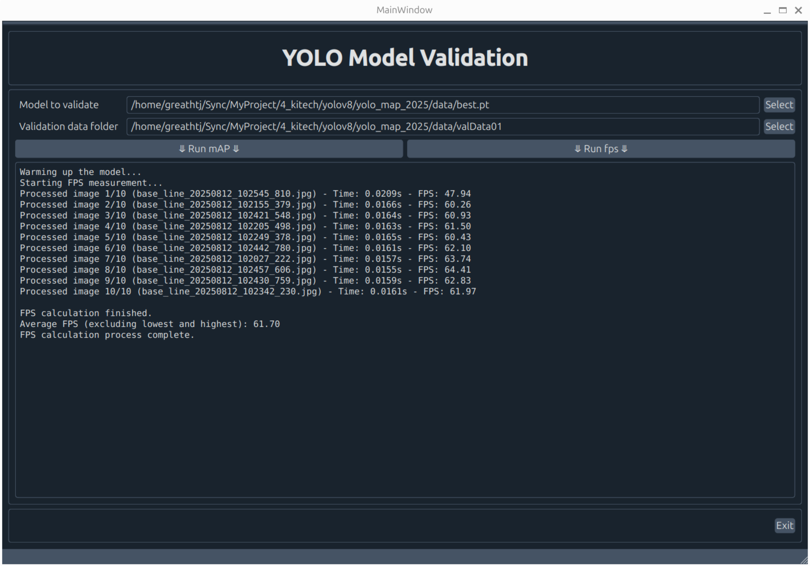

# YOLO Model Validation Tool

A desktop application with a graphical user interface (GUI) for validating YOLO (You Only Look Once) object detection models. It allows users to calculate the mean Average Precision (mAP) and measure the Frames Per Second (FPS) of their `.pt` models on a given dataset.

## Features

- Select a YOLO model file (`.pt`).
- Select a validation dataset folder.
- Run mAP validation.
- Run FPS calculation on validation images.
- Displays real-time output in the GUI.

## Requirements

- Python 3.x
- The libraries listed in the `requirements.txt` file.

## Installation

1.  Clone the repository:
    ```bash
    git clone <repository-url>
    cd <repository-folder>
    ```

2.  Install the required dependencies:
    ```bash
    pip install -r requirements.txt
    ```

## Usage

1.  Run the application:
    ```bash
    python main.py
    ```

2.  Click the top **Select** button to choose your YOLO model (`.pt` file).

3.  Click the second **Select** button to choose your validation data folder. This folder should be structured to contain your `data.yaml` file at its root and have a subdirectory `val/images/` with the validation images.

4.  Click the **▶ Run mAP ▶** button to start the mAP validation.

5.  Click the **▶ Run fps ▶** button to start the FPS calculation.

6.  View the output and results in the text area.

## Screenshot




## License

*(MIT, GPL)*
